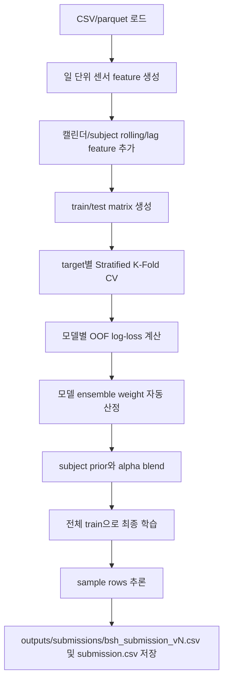

# DACON 236690 CH2026 파이프라인

이 문서는 `solution.py`가 어떤 순서로 동작하는지 정리한 실행 설명서입니다. 현재 대회 리더보드 평가는 7개 binary target(`Q1`, `Q2`, `Q3`, `S1`, `S2`, `S3`, `S4`)의 Average Log-Loss입니다.

## 실행 방법

필요 패키지를 설치한 뒤 아래 명령을 실행합니다.

```bash
pip install -r requirements.txt
python3 solution.py
```

빠른 구조 점검만 하고 싶으면 다음처럼 실행합니다.

```bash
python3 solution.py --fast-dev --force-features
```

## 결과물

실행이 끝나면 아래 파일이 생성됩니다.

| 경로 | 내용 |
| --- | --- |
| `model/model.ipynb_bundle.joblib` | 최종 학습된 target별 모델 ensemble bundle |
| `outputs/reports/cv_results.json` | target별 OOF log-loss, 모델별 점수, blend weight, prior blend alpha |
| `outputs/reports/oof_predictions.csv` | 교차검증 out-of-fold 예측값 |
| `outputs/reports/feature_importance.csv` | LightGBM feature importance 합산 결과 |
| `outputs/cache/feature_cache.parquet` | 센서 parquet에서 만든 일 단위 feature cache |
| `outputs/submissions/bsh_submission_vN.csv` | DACON 업로드용 numbered submission |
| `submission.csv` | 가장 최근 submission 복사본 |

`outputs/submissions/bsh_submission_vN.csv`는 실행할 때마다 `N`이 자동으로 증가합니다. 번호는 `outputs/submissions/.bsh_submission_counter`에 저장되므로, 이전 submission CSV를 삭제해도 다음 번호가 이어집니다.

## 전체 흐름



## 1. 전처리

`ch2026_metrics_train.csv`와 `ch2026_submission_sample.csv`의 key column은 다음과 같습니다.

```text
subject_id, sleep_date, lifelog_date
```

센서 parquet는 `subject_id + lifelog_date` 기준으로 일 단위 집계됩니다.

사용하는 주요 센서 feature:

| 파일 | feature 예시 |
| --- | --- |
| `ch2025_mACStatus.parquet` | 충전 상태 count/mean/change |
| `ch2025_mActivity.parquet` | 활동 상태 통계와 category count/ratio |
| `ch2025_mAmbience.parquet` | ambience top label, entropy, probability |
| `ch2025_mBle.parquet` | BLE RSSI 통계, unique address 수 |
| `ch2025_mGps.parquet` | altitude/latitude/longitude/speed 통계 |
| `ch2025_mLight.parquet` | mobile light 통계 |
| `ch2025_mScreenStatus.parquet` | screen use 통계와 change |
| `ch2025_mUsageStats.parquet` | 앱 사용 시간, 상위 앱별 사용량 |
| `ch2025_mWifi.parquet` | Wi-Fi RSSI 통계, unique BSSID 수 |
| `ch2025_wHr.parquet` | heart rate 배열 flatten 후 통계 |
| `ch2025_wLight.parquet` | wearable light 통계 |
| `ch2025_wPedo.parquet` | step, distance, speed, calories 통계 |

그 뒤 날짜 feature, subject별 rolling mean, lag feature를 추가합니다.

## 2. 교차검증

각 target을 독립적인 binary classification 문제로 보고 target별 `StratifiedKFold`를 수행합니다.

검증 fold마다 다음 모델을 학습합니다.

| 모델 | 사용 조건 |
| --- | --- |
| LightGBM | `lightgbm` 설치 시 사용 |
| XGBoost | `xgboost` 설치 시 사용 |
| CatBoost | `catboost` 설치 시 사용 |
| ExtraTrees | 항상 사용 |
| LogisticRegression | 항상 사용 |

모델별 OOF log-loss가 낮을수록 높은 weight를 받습니다. 단, target별 best model보다 log-loss가 충분히 나쁜 모델은 자동으로 weight 0이 됩니다. 이후 subject별 과거 target 평균 기반 prior와 model ensemble 예측을 섞는 alpha를 target별로 탐색합니다.

마지막으로 OOF 예측에 대해 target별 확률 보정을 한 번 더 탐색합니다.

| 보정 | 의미 |
| --- | --- |
| `temperature` | target 평균 logit을 중심으로 확률 분포를 완만하게 하거나 날카롭게 조정 |
| `mean_shrink` | 예측을 target 평균 쪽으로 일부 수축 |
| `none` | 보정 없음 |

최종 제출 예측은 같은 모델 구조를 여러 seed로 다시 학습한 뒤 평균내는 seed bagging을 사용합니다. 또한 미래 날짜 테스트셋에 더 맞도록 target별 subject prior의 최근일 반영 비율을 다르게 둡니다.

## 3. 최종학습

CV에서 선택된 target별 model weight와 alpha를 사용해 전체 train row로 다시 학습합니다. 최종 bundle은 `model/model.ipynb_bundle.joblib`에 저장됩니다.

## 4. 추론과 제출 파일 생성

sample submission row에 대해 7개 target 확률을 예측합니다. 확률은 log-loss 안정성을 위해 `[1e-5, 1 - 1e-5]` 범위로 clip합니다.

최종 제출 파일은 `outputs/submissions/bsh_submission_vN.csv`로 저장되고, 같은 내용이 루트의 `submission.csv`에도 저장됩니다.

## DACON 업로드

DACON 제출 페이지에서는 CSV 한 개만 업로드하면 됩니다. 업로드할 파일은 보통 `outputs/submissions/bsh_submission_vN.csv` 중 가장 최신 번호 파일입니다.
